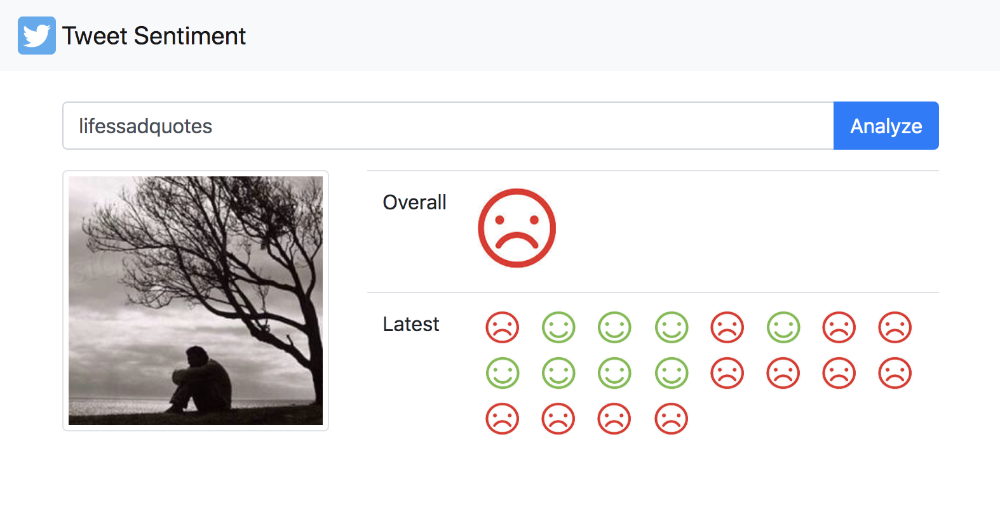

# Tweet Sentiment

## About
* A small app which uses a pre-calculated model to classify tweets.
* The notebook `tweet-sentiment.ipynb` shows how I trained the model.
* The model `tweet-sentiment.pkl` classifies text into a category: `negative (0)`, `neutral (2)`, `positive (4)`.
* The purpose of this project was to gain some experience using fast.ai - text classification.
* I am using the [sentiment140](https://www.kaggle.com/kazanova/sentiment140) data set.
* For more information see fast.ai lessons: 4 [here](https://course.fast.ai/), this [post](https://mc.ai/text-classification%E2%80%8A-%E2%80%8Atwitter-sentiment-analysis/) also helped me to create the classifier.



### Requirements

* [Docker](https://www.docker.com/)

### Installation

#### Api
```bash
// build and run app
./gradlew build run

// stop app
./gradlew stop
```

#### Twitter
Add your `CONSUMER_KEY`, `CONSUMER_SECRET`, `ACCESS_TOKEN` and `ACCESS_TOKEN_SECRET` into `twitter.env`. 

#### Notebook

You will need access to a GPU to run the jupyter notebook. 
Fast.ai recommend using a `p2.xlarge` instance.
Follow the installation guide [here](https://course.fast.ai/start_aws.html).

## Usage

### User interface
```bash
localhost:8000
```